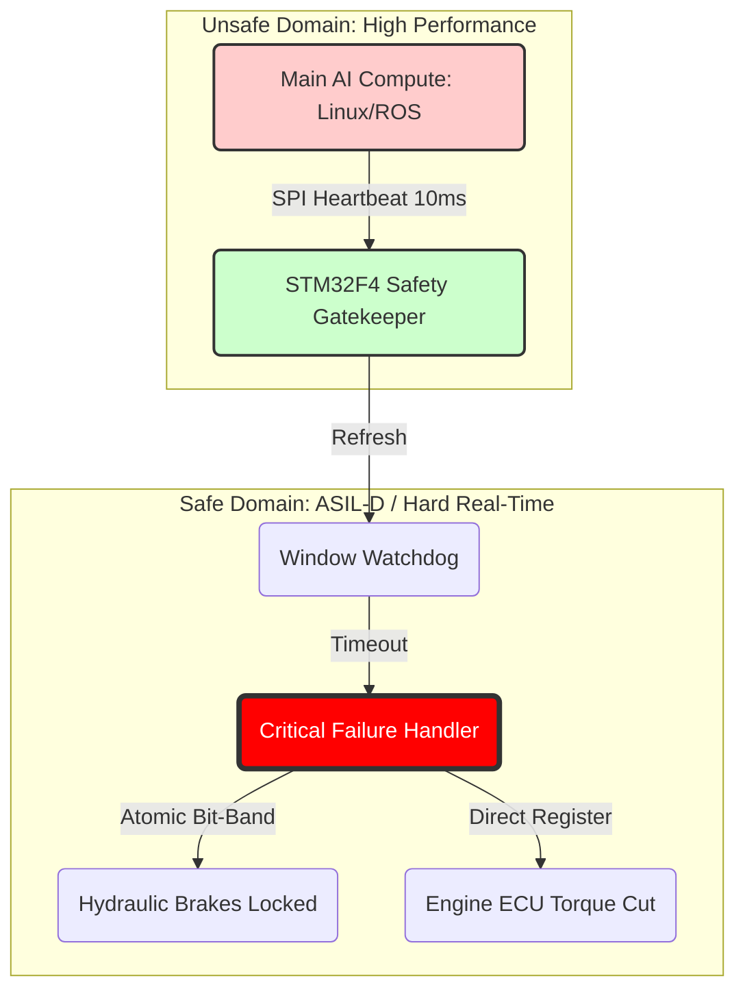

# 🛡️ ISO 26262 ASIL-D Safety Island: The "Panic Button" for L4 Autonomy


> **"In the world of autonomous systems, 'Fast' isn't good enough. We need Deterministic."**
<p align="center">
  <strong>🚘 An Architectural Design Study for Autonomous Emergency Braking (AEB).</strong><br>
  <strong>⚙️ Conceived by Eng. Youssef ATTIA</strong>
</p>

---

## ⚡ Executive Summary
This project implements a **Bare-Metal Safety Gatekeeper** for Level 4 Autonomous Vehicles. It addresses the critical failure mode: **"Loss of Locality"** (e.g., the Primary AI Compute/NVIDIA Orin freezing at highway speeds).

By exploiting the **ARM Cortex-M4 Pipeline Architecture**, this system guarantees a **Safe State Transition** (Torque Cut + Hydraulic Brake Lock) within the strict **Fault Tolerant Time Interval (FTTI) of 20ms**, even in the event of a total kernel panic of the main operating system.

---

## 🏗️ Architecture: The "Safety Island" Concept

The system utilizes a heterogeneous "Check-and-Act" architecture. The STM32F4 acts as an independent auditor of the AI's health.


---

## 📂 System Blueprint

Each file in this repository maps to a specific layer of the **ISO 26262** architecture:

* **`src/safety_core.c`**: The **ASIL-D Logic**. Contains the Bit-Band macros, the `WWDG_IRQHandler`, and the deterministic Jump Table recovery strategy.
* **`include/safety_defs.h`**: The **Hardware Abstraction**. Defines the specific memory addresses (Bit-Band alias, Backup SRAM) and hardware constraints, ensuring `safety_core.c` remains portable and clean.
* **`src/main.c`**: The **Application Layer**. Manages the main "While(1)" loop and the Heartbeat monitoring strategy.
* **`scripts/orin_sim.py`**: The **Validation Tool**. A Python script that acts as the "NVIDIA Orin," generating the heartbeat and injecting fault conditions (Segmentation Faults) to test the STM32's reaction time.

---

## 🚀 Proposed Validation Methodology

### 1. Hardware Prerequisites
* **MCU:** STM32F4 Discovery (or any Cortex-M4F board).
* **Interface:** USB-to-UART Adapter (FTDI/CP2102).
* **Wiring:**
    * **Heartbeat Input:** Connect USB-UART **RTS** Pin $\rightarrow$ STM32 **PA0**.
    * **Brake Output:** Monitor STM32 **PA5** (Onboard LED).
    * **Ground:** Connect USB-UART **GND** $\rightarrow$ STM32 **GND**.

### 2. Software Setup
This project uses **PlatformIO** for build automation and dependency management.
1.  **Install VS Code** + **PlatformIO Extension**.
2.  **Clone the Repo** and open the folder.
3.  **Build & Flash:** Click the "Upload" arrow ($\rightarrow$) in the bottom toolbar.

### 3. Run the "Crash" Simulation
We need to simulate the Primary AI Compute Node (NVIDIA Orin).
1.  Install the Python serial library:
    ```bash
    pip install pyserial
    ```
2.  Run the simulation script (update `COMx` or `/dev/ttyUSBx` in the script first):
    ```bash
    python scripts/orin_sim.py
    ```

### 4. Verification
* **0s - 10s:** The Python script sends a healthy 10ms heartbeat. The STM32 LED (PA5) remains **OFF** (Brakes Released).
* **T = 10s:** The script simulates a **KERNEL PANIC** and stops the heartbeat.
* **T + 20ms:** The STM32 Window Watchdog expires. The **Safe State** is triggered, and the LED (PA5) snaps **ON** (Brakes Locked) instantly.
